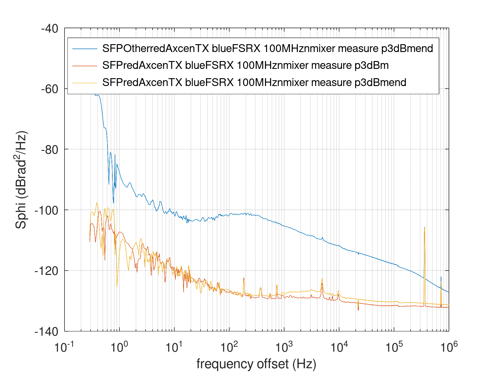

# Brand dependence of the 1Gb SFP phase noise

R&S SMA100A at 100 MHz, 6 dBm output split so 3 dBm to phase station
and 3 dBm to TX.

Direct reference and output to the Phase Station (no mixer), DUT=REF, REF=DUT

Red = Axcen ; Blue = FS

Execute
```
gunzip *tim
octave plot_tim.m
```

## Purple Axcen SFP output, blue FS SFP input:

Same brand (Axcen), two different SFPs exhibitig different phase noise characteristics
under the same measurement conditions:


