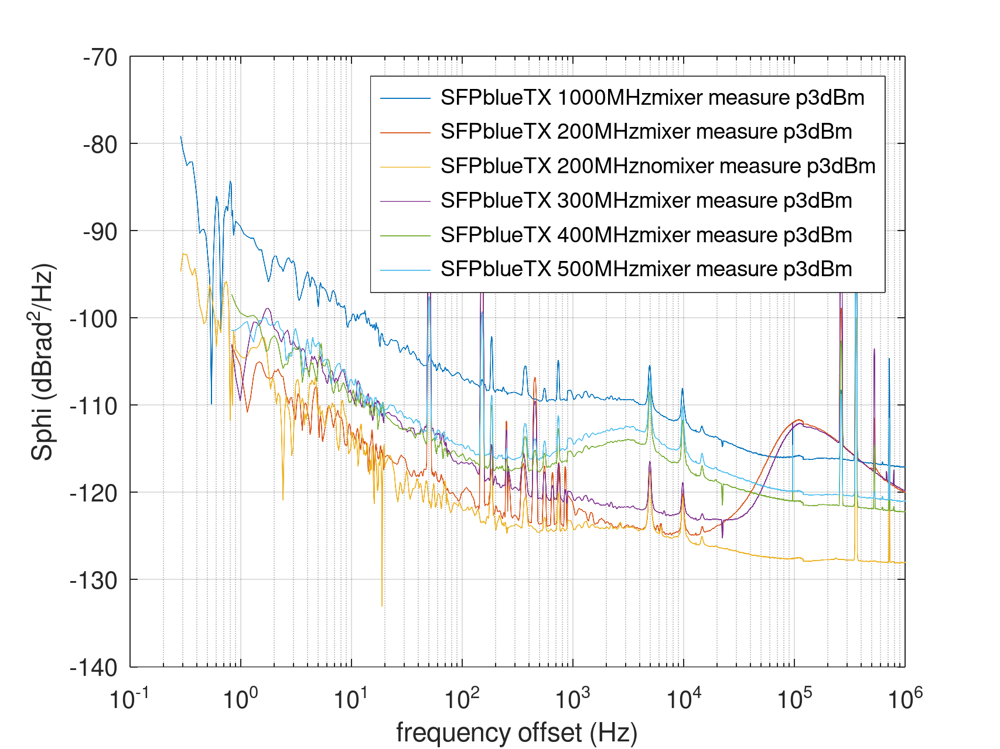

# Drive power dependence of the 1Gb SFP phase noise

R&S SMA100A at various frequencies driving the emitting SFP and
receiving SFP output connected to phase station after mixing with
a second SMA100A set to the frequency -100 MHz and an output power
of 10 dBm to saturate the mixer at 7 dBm after the splitter.

Direct reference and output to the Phase Station (no mixer), DUT=REF, REF=DUT

Execute
```
gunzip *tim
octave plot_tim.m
```

## Blue SFP output, purple SFP input:


