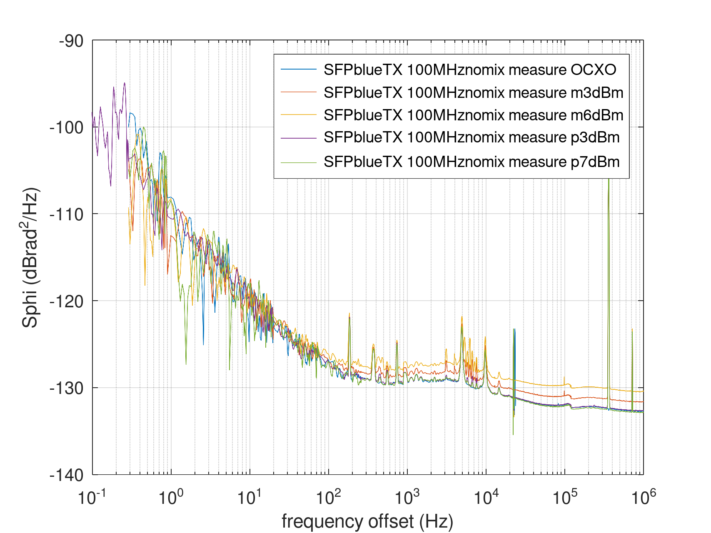
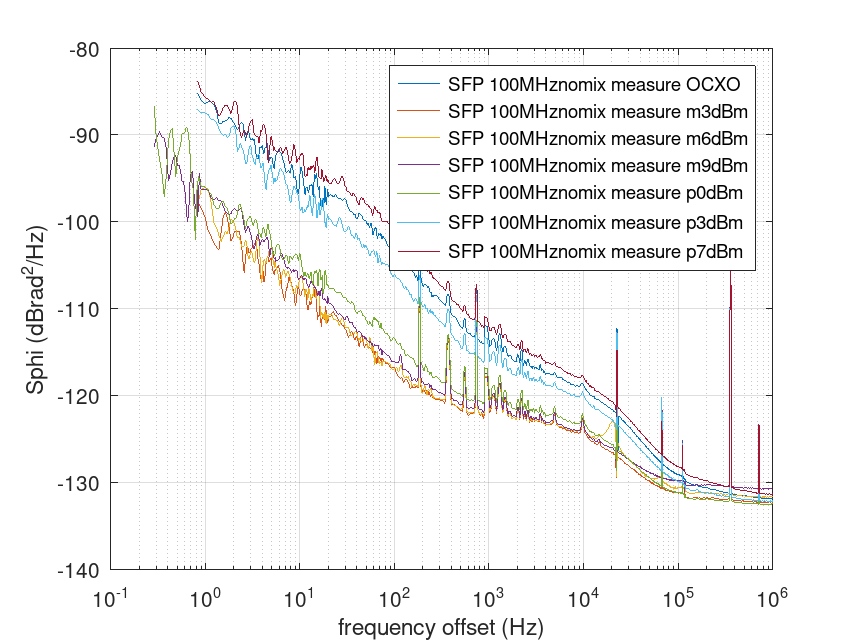

# Drive power dependence of the 1Gb SFP phase noise

R&S SMA100A at various power, and OCXO, driving the emitting SFP and
receiving SFP output connected to phase station.

Direct reference and output to the Phase Station (no mixer), DUT=DUT, REF=REF

Red = Axcen ; Blue = FS

Execute
```
gunzip *tim
octave plot_tim.m
```

## Blue SFP output, purple SFP input:



## Purple SFP output, blue SFP input:


